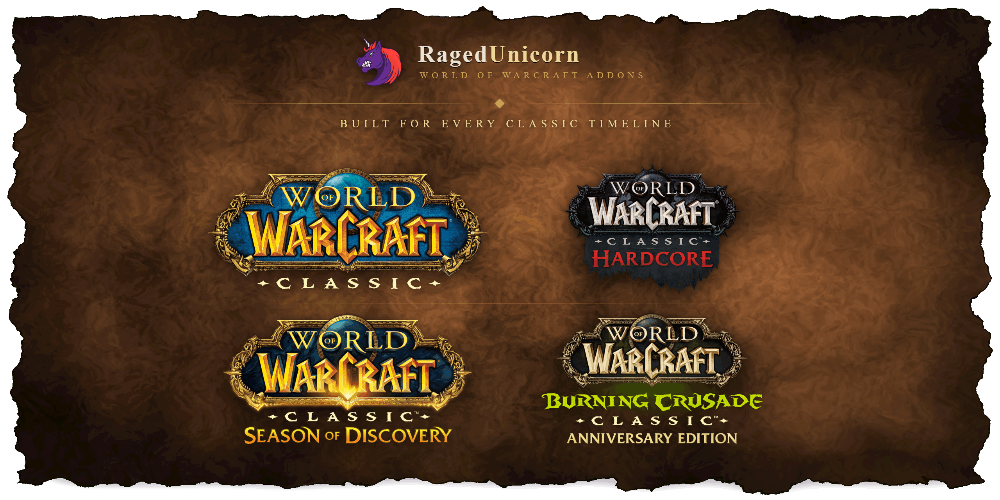
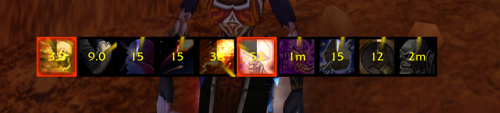
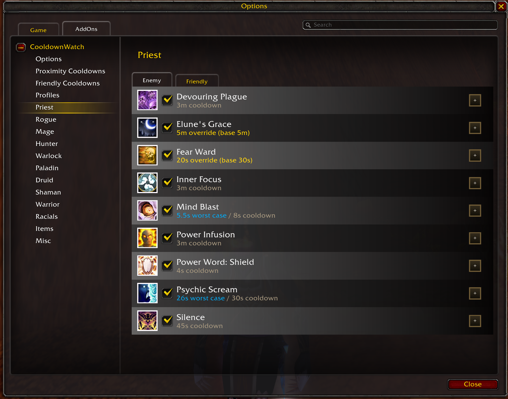
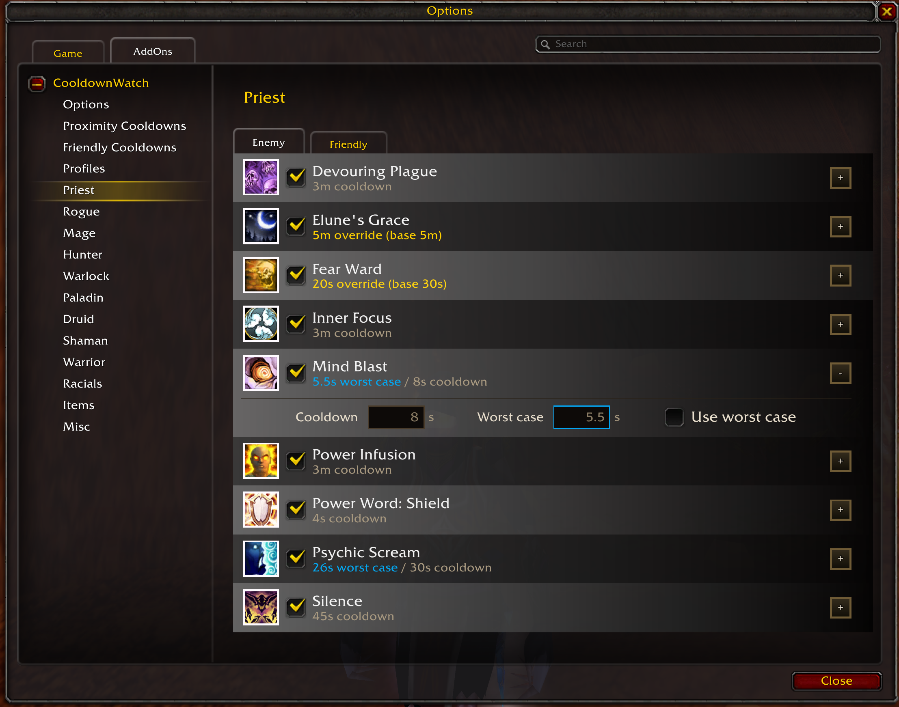
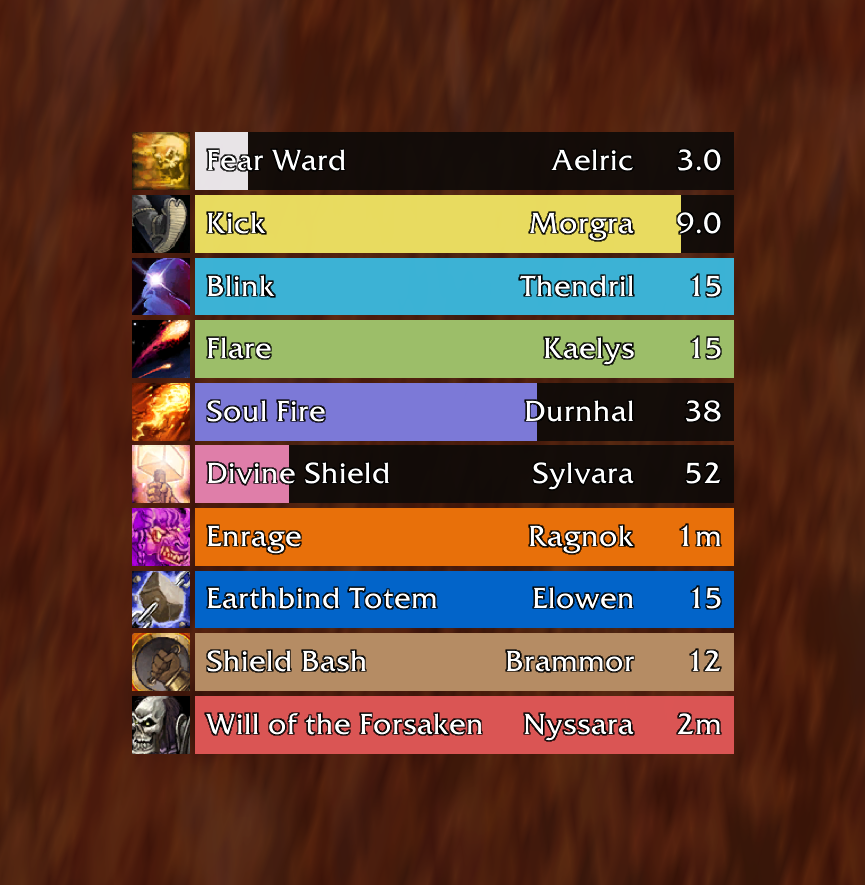
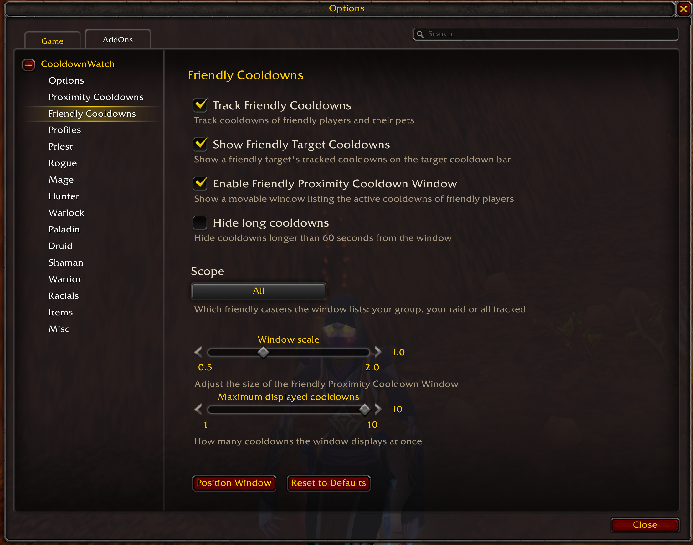
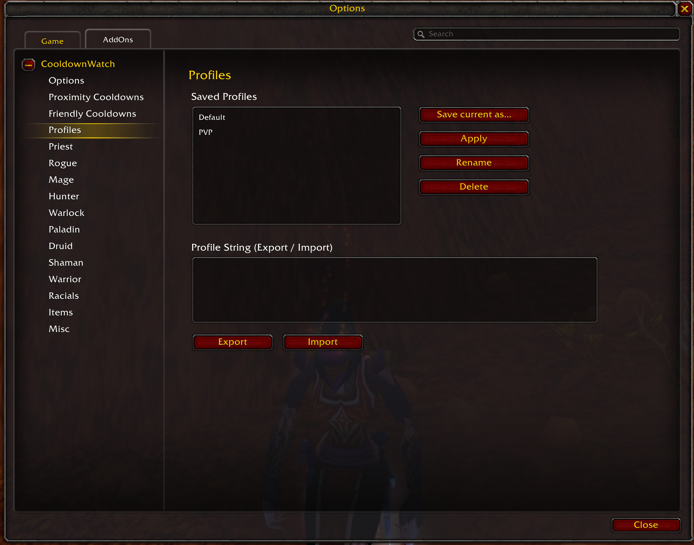

# CooldownWatch



> CooldownWatch aims to track your enemies cooldowns and making them visible to the player


## Providers

[](https://www.curseforge.com/wow/addons/cooldownwatch)
[](https://addons.wago.io/addons/cooldownwatch)

## Installation

WoW-Addons are installed directly in your WoW directory:

`[WoW-installation-directory]\Interface\AddOns`

Make sure to get the newest version of the Addon from the releases tab:

[CooldownWatch-Releases](https://github.com/RagedUnicorn/wow-classic-cooldownwatch/releases)


## What is CooldownWatch?

In PvP the fight is often decided by cooldowns - who still has their escape, their interrupt, their trinket. CooldownWatch watches the combat log for those spells and shows you when your target used one and when it comes back up, so you no longer have to keep that timer in your head.



Everything is derived from the combat log, so there is nothing to configure before it works: CooldownWatch recognizes the spell, resolves the caster (including pets back to their owner), and starts counting down the cooldown on the Targetcooldownbar of that player. Switch targets and the bar follows, showing what that enemy has burned and what is still available to them.

CooldownWatch supports World of Warcraft Classic Era and TBC Anniversary, including Hardcore and Season of Discovery.

## Features of CooldownWatch

* **Tracks enemy cooldowns from the combat log** - no addon required on the other side.
* **Per-target cooldown bar** that follows your current target and can be placed anywhere on screen.
* **Proximity cooldown window** listing the active cooldowns of every enemy around you - not just your target.
* **Friendly cooldown tracking** (opt-in) that shows teammate cooldowns on the target bar and in a window of their own, scoped to your party or raid.
* **A curated spell catalog** covering all nine classes plus racials, items and miscellaneous cooldowns - every entry verified against Wowhead, including all ranks of a spell.
* **Worst case handling** for enemies with talents or gear that shorten a cooldown, globally or per spell.
* **Manual cooldown overrides** per spell when you want the exact number yourself.
* **Pet cooldowns resolved back to their owner**, so a pet ability counts against the player who owns it.
* **Season aware** - Season of Discovery and TBC spells are applied on top of the base catalog for the branch you are playing.
* **Configuration profiles** with export/import for moving a setup between characters or sharing it.

## Configuration

CooldownWatch can be configured through the in-game interface options. Access the configuration by:

1. Opening the game menu (ESC key)
2. Selecting "Options"
3. Navigating to "AddOns"
4. Finding "CooldownWatch" in the list

Alternatively, you can use the slash command: `/cooldownwatch opt` or `/rgcw opt`

### Positioning the bar and windows

Every surface is positioned through its own button in the options: **Position Bar** on the Options panel for the Targetcooldownbar, **Position Window** on the Proximity Cooldowns and Friendly Cooldowns panels for the two windows. The button fills the surface with example cooldowns and makes it draggable - drag it where you want it and click **Apply**. Outside this mode nothing can be moved by accident, so there is no lock to manage. The Targetcooldownbar's size is adjusted with the **Bar scale** slider on the same Options panel.

For the Targetcooldownbar, `/rgcw conf enable` brings up the same example preview directly and `/rgcw conf disable` hides it again.

### Choosing what to track



Tracked cooldowns are grouped into categories - one per class (Priest, Rogue, Mage, Hunter, Warlock, Paladin, Druid, Shaman, Warrior) plus **Racials**, **Items** and **Misc**. Every spell can be enabled or disabled on its own, so you can narrow tracking down to the handful of cooldowns that actually matter to you. Each category panel carries an **Enemy** and a **Friendly** tab - the same spell list, configured separately per side, so what you track on enemies is independent of what you track on teammates.

Each spell also carries two per-spell settings:



- **Use worst case**: assume the enemy has the talents or gear that shorten this cooldown. The bar then counts down the shortest realistic cooldown instead of the base value.
- **Cooldown override**: manually set the tracked cooldown in seconds. It takes precedence over all worst case settings and accepts any value up to 60 minutes - above the base cooldown too, for when you know the enemy's real cooldown better than the addon does.

**Assume worst case for all cooldowns** applies the worst case to everything at once. Worst case settings on individual cooldowns still take precedence.

### Proximity Cooldowns

The Targetcooldownbar only ever shows your current target. The **Proximity Cooldown Window** lists the active cooldowns of every other enemy around you - one row per cooldown with the spell, the caster's name and the remaining time, newest on top. Your current target is excluded, since its cooldowns are already on the bar.



The window is opt-in and configured on the **Proximity Cooldowns** panel: **Hide long cooldowns** keeps cooldowns above 60 seconds out of the window (enabled by default - long cooldowns rarely decide the next engagement), the **Window scale** and **Maximum displayed cooldowns** sliders control its size, and **Reset to Defaults** restores every setting including the window position.

### Friendly Cooldowns

CooldownWatch can watch your own side too. **Track Friendly Cooldowns** tracks friendly players and their pets the same way enemies are tracked - your own cooldowns are excluded. Two displays build on it, each with its own toggle:



- **Show Friendly Target Cooldowns** shows a targeted teammate's tracked cooldowns on the Targetcooldownbar.
- **Enable Friendly Proximity Cooldown Window** opens a second proximity window for friendly cooldowns, with a **Scope** filter (your group, your raid, or all tracked players) and the same hide-long, scale and size options as the enemy window.

Which spells are tracked per side is chosen on the **Friendly** tab of each category panel.

## Profiles

CooldownWatch lets you save your configuration as named profiles, so you can switch between different setups or carry your settings to another character. Profiles are managed under the **Profiles** tab of the configuration interface.



A profile captures all of your CooldownWatch settings - which cooldowns are tracked per category and side, the per-spell worst case and cooldown override values, the *Assume worst case for all cooldowns* default, the friendly tracking flags, the proximity window options, and the scale and on-screen position of every surface.

- **Save current as...**: Snapshots your current settings into a new named profile (or overwrites an existing one of the same name).
- **Apply**: Loads the selected profile and applies its settings. This overwrites your current settings and reloads the UI.
- **Rename**: Renames the selected profile.
- **Delete**: Removes the selected profile.

### The Default Profile

Every character starts with a profile named **Default**. It holds CooldownWatch's shipped settings and is created automatically - you never have to save it yourself. It cannot be deleted, renamed or overwritten, so there is always a clean baseline to go back to: select **Default** and click **Apply** to reset CooldownWatch to its factory settings. The Rename and Delete buttons are greyed out while it is selected.

### Sharing Profiles (Export / Import)

Profiles can be shared as portable strings, making it easy to copy a setup between characters or hand it to another player.

- **Export**: Generates a copy-pasteable profile string for the selected profile in the *Profile String* field.
- **Import**: Paste a profile string into the field and import it as a new profile. Imported strings are validated, so an invalid, corrupted, or non-CooldownWatch string is rejected without changing any of your settings.

> Note: Profiles are stored per character. Use export/import to move a profile to another character.

## Contributing

See [CONTRIBUTING.md](CONTRIBUTING.md) - from reporting wrong cooldown data to contributing
SpellMap entries, including the lint and test gates every pull request must pass.

## Development

### Switching between Environments

Switching between development and release can be achieved with maven.

```
mvn generate-resources -D generate.sources.overwrite=true -P development
```

This generates and overwrites `CW_Environment.lua` and `CooldownWatch.toc`. You need to specifically specify that you want to overwrite to files to prevent data loss. It is also possible to omit the profile because development is the default profile that will be used.

Switching to release can be done as such:

```
mvn generate-resources -D generate.sources.overwrite=true -P release
```

In this case it is mandatory to add the release profile.

**Note:** Switching environments has the effect changing certain files to match an expected value depending on the environment. To be more specific this means that as an example test and debug files are not included when switching to release. It also means that variables such as loglevel change to match the environment.

As to not change those files all the time the repository should always stay in the development environment. Do not commit `CooldownWatch.toc` and `CW_Environment.lua` in their release state. Changes to those files should always be done inside `build-resources` and their respective template files marked with `.tpl`.

### Packaging the Addon

To package the addon use the `package` phase.

```
mvn package -D generate.sources.overwrite=true -P development
```

This generates an addon package for development. For generating a release package the release profile can be used.

```
mvn package -D generate.sources.overwrite=true -P release
```

**Note:** This packaging and switching resources can also be done one after another.

```
# switch environment to release
mvn generate-resources -D generate.sources.overwrite=true -P release
# package release
mvn package -P release
```

### Deploy GitHub Release

Before creating a new release update `addon.tag.version` in `pom.xml`. Afterwards to create a new release and deploy to GitHub the `deploy-github` profile has to be used.

```
# switch environment to release
mvn generate-resources -D generate.sources.overwrite=true -P release
# deploy release
mvn package -P deploy-github -D github.auth-token=[token]
```

**Note:** This is only intended for manual deployment to GitHub. With GitHub actions the token is supplied as a secret to the build process

### Deploy CurseForge Release

**Note:** It's best to create the release for GitHub first and only afterwards the CurseForge release. That way the tag was already created.

```
# switch environment to release
mvn generate-resources -D generate.sources.overwrite=true -P release
# deploy release
mvn package -P deploy-curseforge -D curseforge.auth-token=[token]
```

**Note:** This is only intended for manual deployment to CurseForge. With GitHub actions the token is supplied as a secret to the build process

### Deploy Wago.io Release

**Note:** It's best to create the release for GitHub first and only afterwards the Wago.io release. That way the tag was already created.

```
# switch environment to release
mvn generate-resources -D generate.sources.overwrite=true -P release
# deploy release
mvn package -P deploy-wago -D wago.auth-token=[token]
```

**Note:** This is only intended for manual deployment to Wago.io. With GitHub actions the token is supplied as a secret to the build process

### GitHub Action Profiles

This project has GitHub action profiles for different DevOps-related work such as linting and deployments to different providers. See `.github` folder for details.

## License

MIT License

Copyright (c) 2026 Michael Wiesendanger

Permission is hereby granted, free of charge, to any person obtaining
a copy of this software and associated documentation files (the
"Software"), to deal in the Software without restriction, including
without limitation the rights to use, copy, modify, merge, publish,
distribute, sublicense, and/or sell copies of the Software, and to
permit persons to whom the Software is furnished to do so, subject to
the following conditions:

The above copyright notice and this permission notice shall be
included in all copies or substantial portions of the Software.

THE SOFTWARE IS PROVIDED "AS IS", WITHOUT WARRANTY OF ANY KIND,
EXPRESS OR IMPLIED, INCLUDING BUT NOT LIMITED TO THE WARRANTIES OF
MERCHANTABILITY, FITNESS FOR A PARTICULAR PURPOSE AND
NONINFRINGEMENT. IN NO EVENT SHALL THE AUTHORS OR COPYRIGHT HOLDERS BE
LIABLE FOR ANY CLAIM, DAMAGES OR OTHER LIABILITY, WHETHER IN AN ACTION
OF CONTRACT, TORT OR OTHERWISE, ARISING FROM, OUT OF OR IN CONNECTION
WITH THE SOFTWARE OR THE USE OR OTHER DEALINGS IN THE SOFTWARE.
